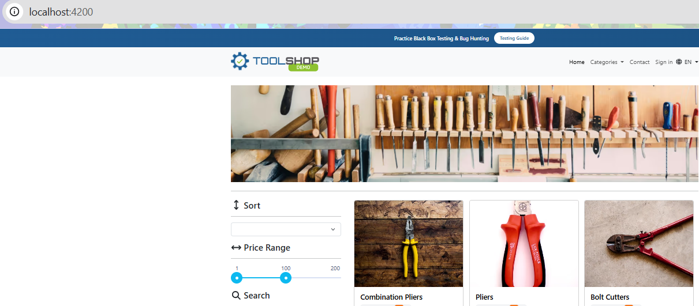
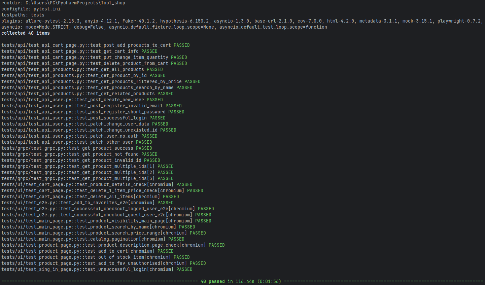
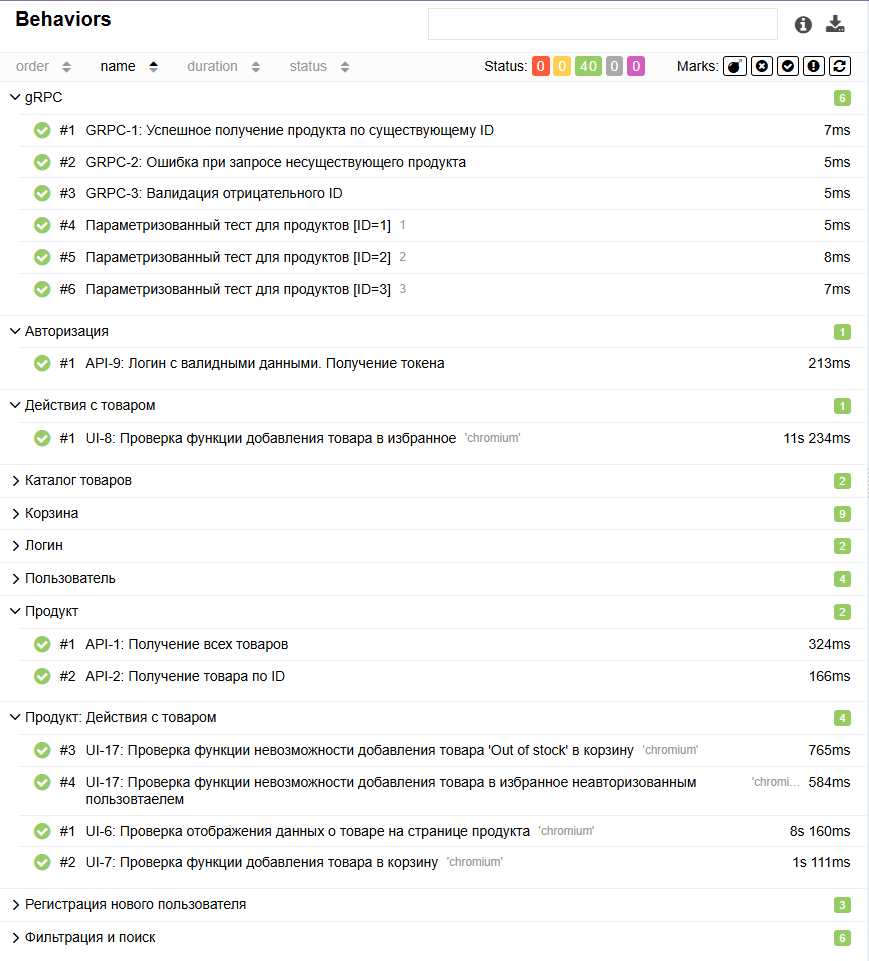
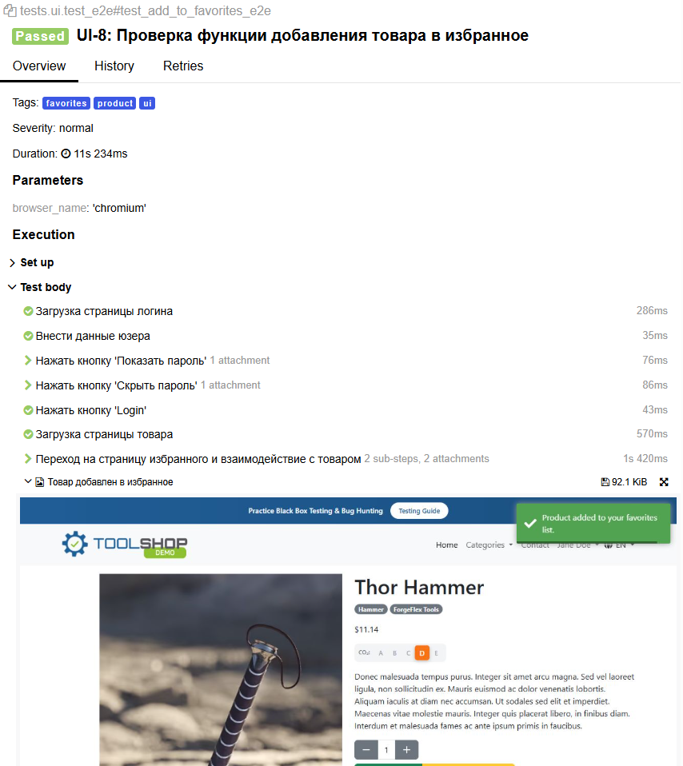
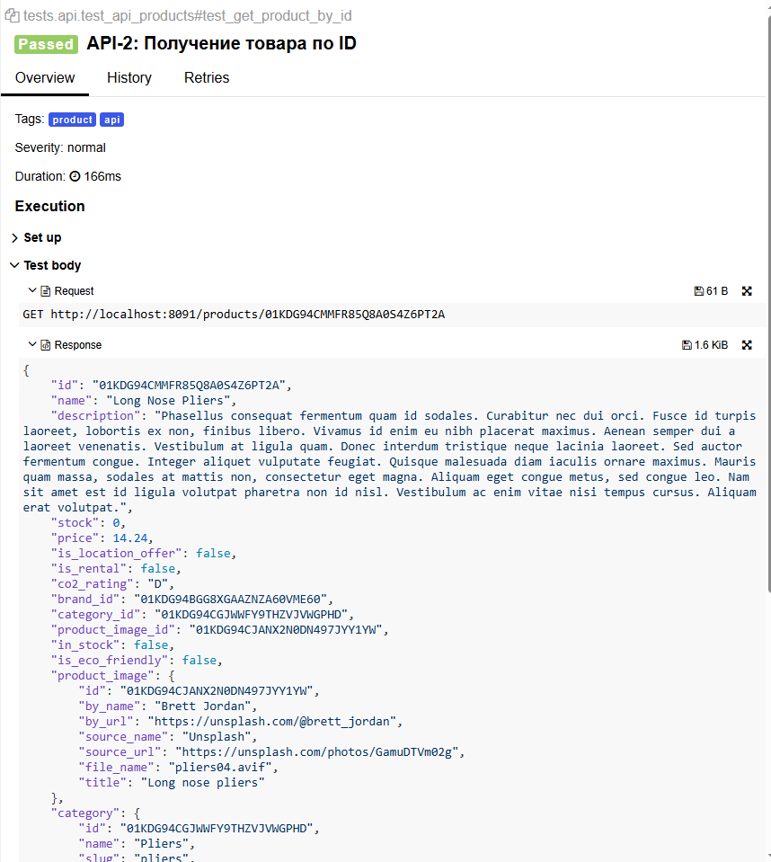
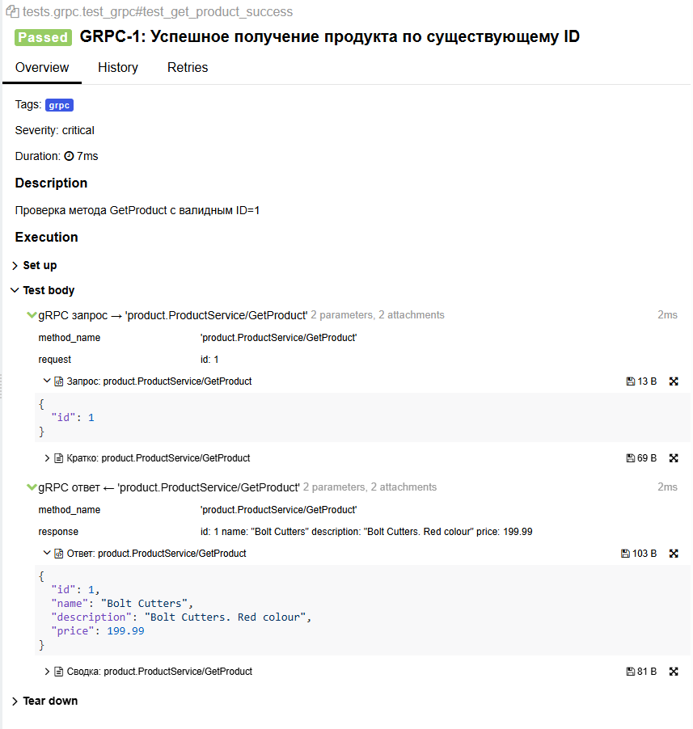

<h1> Проект по тестированию демо-проекта "Tool Shop"</h1>



----
### Проект реализован с использованием:
        


Проект основан на учебном приложении <a href="https://github.com/testsmith-io/practice-software-testing.git">TestSmith Practice Software Testing</a> - интернет-магазине инструментов с трёхслойной архитектурой (UI + REST API + gRPC).
## Запуск приложения
### Требования
|  Компонент       | Версия     |              Установка              |
|:-----------------|:----------:|:-----------------------------------:|
| Docker           | 20.10+     | https://www.docker.com/get-started  |
| Docker Compose   | 2.0+       |   Входит в состав Docker Desktop    |
| Python           | 3.10+      |  https://www.python.org/downloads/  |
| Poetry           | 1.6+       |         pip install poetry          |

### Запуск тестируемого приложения

Клонируем официальный репозиторий приложения
```bash
git clone https://github.com/testsmith-io/practice-software-testing.git
cd practice-software-testing
```
Запускаем все сервисы через Docker Compose
```bash
docker-compose up -d
```

### Проверка работоспособности
| Сервис       |                       URL                        |                Описание                 |
|:-------------|:------------------------------------------------:|:---------------------------------------:|
| UI           |              http://localhost:4200               |         Веб-интерфейс магазина          |
| API Docs     |     http://localhost:8091/api/documentation      |      Swagger UI для REST API            |
| gRPC         |          http://localhost:50051                  | gRPC endpoint (проверяется через тесты) |

### Настройка тестового окружения
```bash
# Вернись в папку с тестами
cd ../Tool_shop

# Установи зависимости через Poetry
poetry install

# Активируй виртуальное окружение
poetry shell
```

### UI-тесты

- [x] Проверка отображения списка товаров на главной странице
- [x] Проверка отображения результатов поиска товара по названию
- [x] Проверка отображения результатов поиска товаров по фильтру 'Эко-товары'
- [x] Проверка отображения результатов поиска товаров по цене в диапазоне от 15 до 28$
- [x] Проверка пагинации каталога
- [x] Проверка возможности залогиниться с действительными почтой и паролем
- [x] Проверка невозможности залогиниться с несуществующими в базе почтой и паролем
- [x] Проверка отображения данных о товаре на странице продукта
- [x] Проверка функции добавления товара в корзину
- [x] Проверка функции невозможности добавления товара 'Out of stock' в корзину
- [x] Проверка функции невозможности добавления товара в избранное неавторизованным пользователем
- [x] Проверка отображения данных о товаре + цены в корзине
- [x] Проверка удаления товара из корзины: 2 товара + перерасчет цены
- [x] Проверка удаления всех товаров из корзины
- [x] Проверка функции добавления товара в избранное
- [x] Проверка возможности оформить заказ зарегистрированным пользователем
- [x] Проверка возможности оформить заказ зарегистрированным пользователем-гостем

### API-тесты

- [x] Получение всех товаров
- [x] Получение товара по ID
- [x] Получение товаров, отсортированных по цене
- [x] Поиск товаров по названию
- [x] Поиск связанных товаров
- [x] Создание нового пользователя
- [x] Попытка регистрации с пустым полем email
- [x] Попытка регистрации с коротким паролем
- [x] Логин с валидными данными. Получение токена
- [x] Частичное изменение данных пользователя - изменить адрес
- [x] Попытка поменять данные с несуществующим id
- [x] Попытка поменять данные неавторизованным пользователем
- [x] Попытка поменять данные другого пользователя авторизованным пользователем
- [x] Добавить товары в корзину
- [x] Получить данные корзины
- [x] Обновить количество товара в корзине
- [x] Удалить товар из корзины

### gRPC-тесты

- [x] Успешное получение продукта по существующему ID
- [x] Ошибка при запросе несуществующего продукта
- [x] Валидация отрицательного ID
- [x] Проверка получения нескольких продуктов из демо-базы


### Результат прогона тестов


----
### Allure отчет
#### Общие результаты


#### Пример отчета о прохождении ui-теста


#### Пример отчета о прохождении api-теста


#### Пример отчета о прохождении grpc-теста



