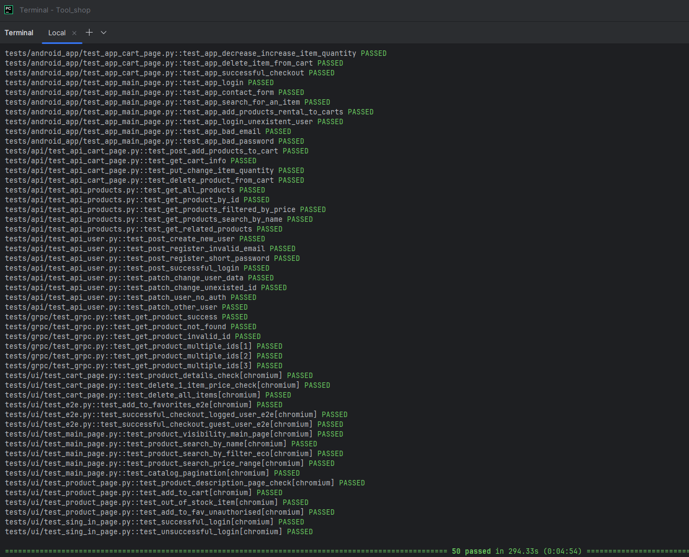
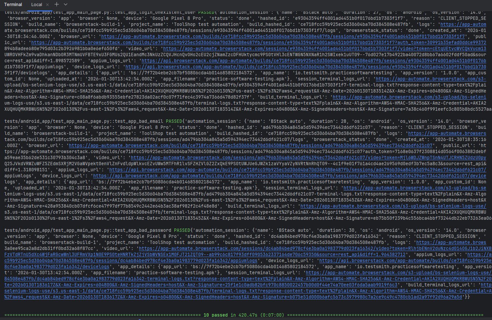
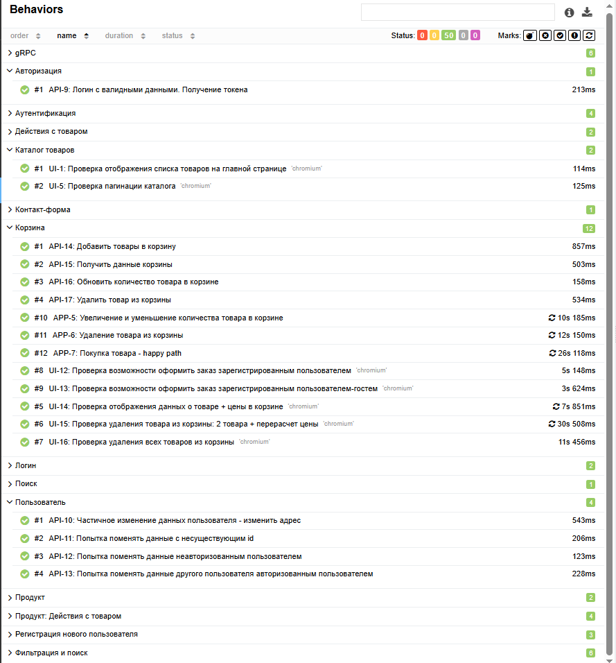
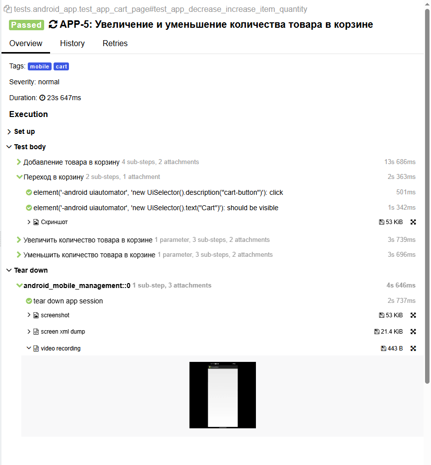
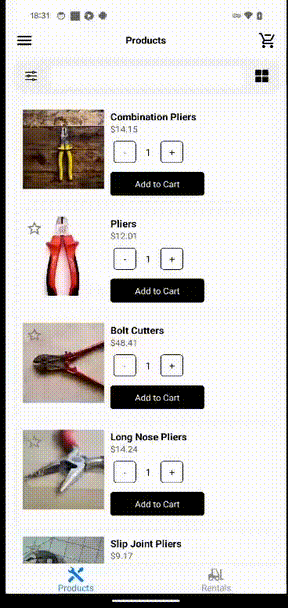

<h1> Автотестирование Tool Shop: UI, API, gRPC и Android </h1>


Проект для портфолио: Полное покрытие тестами интернет-магазина инструментов из <a href="https://github.com/testsmith-io/practice-software-testing.git">TestSmith Practice Software Testing</a> 
Трёхслойная архитектура (UI + REST API + gRPC), плюс мобильное app для <a href="https://testsmith.ams3.cdn.digitaloceanspaces.com/artifacts/practice-software-testing.ipa">iOS</a> и <a href="https://testsmith.ams3.cdn.digitaloceanspaces.com/artifacts/practice-software-testing.apk">Android</a>.

Тестировала Android-приложение локально на устройстве и через BrowserStack. Покрыла UI (Playwright), API (requests), gRPC (grpcio), мобилку (Appium + Selene). Всё на pytest с Allure-отчётами.

----
### Проект реализован с использованием:
          


## Быстрый запуск
### Требования
|  Компонент       | Версия     |              Установка              |
|:-----------------|:----------:|:-----------------------------------:|
| Docker           | 20.10+     | https://www.docker.com/get-started  |
| Docker Compose   | 2.0+       |   Входит в состав Docker Desktop    |
| Python           | 3.10+      |  https://www.python.org/downloads/  |
| Poetry           | 1.6+       |         pip install poetry          |


Запуск приложения
```bash
git clone https://github.com/testsmith-io/practice-software-testing.git
cd practice-software-testing
docker compose up -d  # Проверяем: UI на http://localhost:4200, API на http://localhost:8091/api/documentation
```

Запуск gRPC сервера
```bash
cd ../Tool_shop  
python -m tests.grpc.server
```

Настройка тестов
```bash
cd ../Tool_shop  
poetry install
poetry shell
```

Прогон тестов
```bash
pytest tests/ui/     # Или pytest tests/ для всего
allure serve  # Отчёты
```

## Реализованные тесты (100% passed)

### UI-тесты(Playwright, 17 тестов)
- [x] Главная, поиск, фильтры, пагинация
- [x] Логин/аутентификация (валид/инвалид)
- [x] Корзина: добавление, удаление, расчёт цены
- [x] Избранное, оформление заказа (гость/пользователь)

### API-тесты(requests, 17 тестов)
- [x] CRUD товары/пользователи/корзина
- [x] Валидация (пустые поля, короткий пароль)
- [x] Авторизация, токены, права доступа

### gRPC-тесты(grpcio, 4 теста)
- [x] Получение продуктов, ошибки, валидация ID

### Android (Appium + Selene, BrowserStack + локально)
- [x] Полный функционал app (UI, корзина, заказы)


### Результат прогона тестов (прогон мобильных тестов производился локально, на подключенном к компьютеру устройстве)


### Результат прогона мобильных тестов через BrowserStack 


----
### Allure отчет
#### Общие результаты


#### Пример отчета о прохождении ui-теста


#### Пример отчета о прохождении api-теста


#### Пример отчета о прохождении grpc-теста


#### Пример отчета о прохождении mobile-теста через BrowserStack с автоматическим добавлением видео о прогоне в каждый тест


### Пример видео прохождения mobile-автотестoв


Репозиторий: github.com/ZaitsevaYG/Ui_Api_gRPC_testProject
Контакты: zaitseva.yg@gmail.com / @ZaitsevaYana (Telegram)